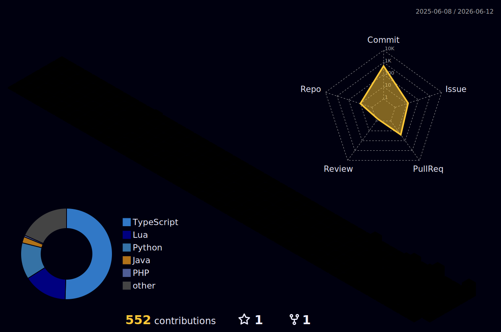

# Hi, I'm Georges-Noé 👋

I'm a **Software Engineer** & **Information Systems student** (2nd year @ Lomé Business School, Togo) — passionate about building clean, scalable, and well-crafted digital products.

I work across the full stack: web, mobile, databases, and system design. I care deeply about code quality, architecture, and developer experience. Currently sharpening my skills and laying the groundwork to become an entrepreneur after graduation.

I speak **Ewe** (native), **French**, **English**, and a bit of **Spanish** and **Deutsch**.

---

## 🧠 What I Do

- **Web Development** — Full-stack web apps with modern frameworks and clean architecture
- **Mobile Development** — Cross-platform mobile apps (React Native / Expo, Flutter)
- **Database Administration** — Schema design, query optimization, multi-DB environments
- **UI/UX Design** — Minimalist and premium interfaces inspired by Notion, Linear, Apple, and Stripe
- **Team Leadership** — Coordinating dev teams, defining technical direction, driving delivery

---

## 🛠️ Tech Stack

**Frontend**
`TanStack Start` `React` `Next.js` `Shadcn/ui` `TanStack` `Tailwind CSS`

**Mobile**
`React Native` `Expo` `Uniwind` `Flutter`

**Backend**
`Next.js (Server Actions)` `Hono` `NestJS` `Spring Boot` `Expressjs` `Django` `FastAPI`

**Databases**
`PostgreSQL` `MySQL / MariaDB` `Supabase` `Neon Postgres` `Firebase` `Redis`

**Auth & ORM**
`Better Auth` `Prisma` `Drizzle ORM`

**Practices**
`Clean Architecture` `REST API Design` `CI/CD` `Agile / Kanban`

---

## 🤝 Open to Collaboration

I'm actively looking to:

- 🚀 **Collaborate on open-source projects** — especially around developer tooling, productivity, and fintech
- 🏆 **Participate in hackathons** — I enjoy tackling real-world problems under pressure and shipping fast
- 💡 **Connect with builders and makers** — if you're working on something meaningful, let's talk

> Whether it's a weekend hackathon or a long-term open-source contribution — I'm in.

---

## Badges

  

  
  

  
  
  

   <kbd>
  
  
  
  
  </kbd>

## Streak stats

  
  
  

## 3D Contributions

